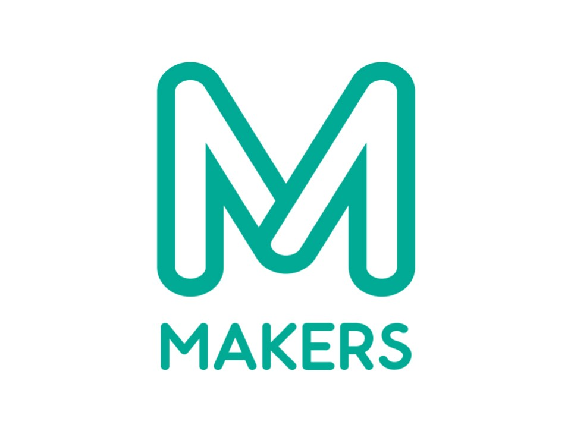

<!--
*** Thanks for checking out this README Template. If you have a suggestion that would
*** make this better, please fork the repo and create a pull request or simply open
*** an issue with the tag "enhancement".
*** Thanks again! Now go create something AMAZING! :D
***
***
***
*** To avoid retyping too much info. Do a search and replace for the following:
*** github_username, repo, twitter_handle, email
-->


<!-- PROJECT SHIELDS -->
<!--
*** I'm using markdown "reference style" links for readability.
*** Reference links are enclosed in brackets [ ] instead of parentheses ( ).
*** See the bottom of this document for the declaration of the reference variables
*** for contributors-url, forks-url, etc. This is an optional, concise syntax you may use.
*** https://www.markdownguide.org/basic-syntax/#reference-style-links
-->
[](https://semver.org)
[](https://semver.org)
[![Contributors][contributors-shield]][contributors-url]
[![Forks][forks-shield]][forks-url]
[![Stargazers][stars-shield]][stars-url]
[![Issues][issues-shield]][issues-url]
[](https://opensource.org/licenses/MIT)


<!-- PROJECT LOGO -->
<br />
<p align="center">
  <a href="https://github.com/github_username/repo">
    
  </a>

  <h3 align="center">Virtual-Inventory 가상 인벤토리 플러그인</h3>

  <p align="center">
    Virtual-Inventory Plugin은 마인크래프트에서 사용자에게 가상의 인벤토리를 제공해주는 Plugin이다.<br/>
    <br />
    <a href="https://github.com/xhdtn8070/Virtual-Inventory"><strong>Github »</strong></a>
    <br />
  </p>
</p>


<!-- TABLE OF CONTENTS -->
## Table of Contents

* [About the Project](#about-the-project)
  * [Built With](#built-with)
* [Getting Started](#getting-started)
  * [Download Jar](#download-jar)
  * [Installation](#installation)
* [Usage](#usage)
* [Permission](#permission)
* [Command](#command)
* [Change](#change)
* [Development plan](#development-plan)
* [License](#license)
* [Contact](#contact)


<!-- ABOUT THE PROJECT -->
## About The Project

[![Product Name Screen Shot][product-screenshot]](https://example.com)

**Virtual-Inventory Plugin**은 마인크래프트에서 사용자에게 **가상의 인벤토리**를 제공해주는 Plugin이다.<br/>
**Spigot-API** 기반으로 작성되어 **Spigot, Paper** 버킷에서 사용가능하다.<br/>
Plugin에서 사용되는 메시지를 사용자가 지정할 수 있도록 개발되었다.<br/>
`Logging 등 관리 측면의 기능 개발`은 추후 진행될 예정이다.<br/>


### Built With

* [Spigot-api 1.16.1](https://getbukkit.org/download/spigot)
* [Java 1.8](https://www.oracle.com/kr/java/technologies/javase/javase-jdk8-downloads.html)
* [Maven 3.6](https://maven.apache.org/download.cgi)


<!-- GETTING STARTED -->
## Getting Started

To get a local copy up and running follow these simple steps.

### Download Jar
* [Version-1.0](https://static-sample.tikim.org/Virtual-Inventory/virtual-inventory-1.0.jar)
* [Version-1.1](https://static-sample.tikim.org/Virtual-Inventory/virtual-inventory-1.1.jar)
* [Version-1.1.1](https://static-sample.tikim.org/Virtual-Inventory/virtual-inventory-1.1.1.jar)

### Installation
설치
1. Clone this repo
```sh
git clone https://github.com/xhdtn8070/Virtual-Inventory.git
```
2. cd repo
```sh
cd ./Virtual-Inventory
```
3. build
```sh
mvn clean package jar:jar -DskipTests
```


<!-- USAGE EXAMPLES -->
## Usage
사용법
```
	1. /plugins 아래에 virtual-inventory-{version}.jar 위치 
	2. /서버 동작
	3. /plugins 아래에 다음과 같은 항목 자동 생성 됨
		- VirturalInventoryPlugin/inventory
		- VirturalInventoryPlugin/config.yml
		- VirturalInventoryPlugin/message.yml
	4. config.yml, message.yml을 변경하고 커맨드에서 /reload confirm 입력하면 설정 적용됨.
```

## Permission
권한
```
    - vc.admin
	* luckPerm Plugin을 이용하여 '/lp user KOO_MA permission set vi.admin true' 커맨드 적용해주면 권한 등록완료
	* luckPerm Plugin을 사용하지 않고 permission 파일을 수정하여도 상관없음
```

## Config
설정
```
	- 아래 파일 내부에 설명 첨부.
	- /plugins/VirturalInventoryPlugin/config.yml
	- /plugins/VirturalInventoryPlugin/message.yml
```

<hr>

## Command
커맨드
```bash
/vi
	- version 설명

/vi {info or i}
	- 커맨드 자체의 설명
	
/vi {help or h}
	- 명령어 소개
	
/vi opt
	- 현재 적용되어 있는 옵션 보여줌
	- permission
		- vc.admin	
		
/vi {name n} {#displayName}
	- displayName에 해당하는 실제 유저의 Name을 알 수 있음
	- 온라인 유저만 가능
	
/vi {list or l}
	- 자신의 창고 리스트를 확인할 수 있음

/vi {list or l} {#userName}
	- 다른 사람의 가상 인벤토리 리스트를 확인할 수 있음
	- permission
		- vc.admin

/vi {create or c} {#InventoryName}
	- 자신의 가상 인벤토리를 생성한다.

/vi {open or o} {#InventoryName}
	- 자신의 {#InventoryName}이라는 가상 인벤토리를 오픈한다.

/vi {openother or oo} {#userName} {#InventoryName}
	- 다른 사람의 가상 인벤토리를 오픈한다 확인할 수 있음
	- permission
		- vc.admin

/vi {remove or rm} {#InventoryName}
	
/vi {removeother or rmo} {#userName} {#InventoryName}
	- 다른 사람의 인벤토리를 삭제한다.
	- permission
		- vc.admin

/vi saveAll
	- 모든 사람의 인벤토리 저장
	- permission
		- vc.admin
```

## Change
변경점
```bash
    1.0 : -
    1.1 : other 명령어 변경, Tab Complete
    1.1.1 : /vi oo {Player} {Inventory} 명령어의 Tab Complete 버그 픽스 
```
삭제
```bash
/vi save
	- 자신의 인벤토리 저장
	- 서버 렉을 발생시키는 등의 비효율적인 현상이 예상되서 개발 단계에서 제거.
```

## Development plan
개발 계획
```bash

/backup 
	- backup 생성
	- permission
		- vc.admin
		
backup 생성 방식
	ex) backup/2020/07/25 - userName.InventoryName-timestamp.txt
	
history 생성 방식
	ex) history/2020/07/25 - userName.InventoryName.txt
	한줄추가 한줄추가

    * db 안쓰고는 페이지네이션 처리 등에 문제가 생길 수 있다.
    * 파일 버전에서는 제공되지 않고 디비 버전에서는 사용될 수 있음.
    * 파일 버전에서는 직접 텍스트 문서만 읽을 수 있도록 제작할 예정
    * /vi {history or h}
```

<!-- CONTACT -->
## Contact

Pull requests are welcome. For major changes, please open an issue first to discuss what you would like to change.

Please make sure to update tests as appropriate.

tongil kim - xhddlf8070@gmail.com -email

Project Link: [https://github.com/xhdtn8070/Virtual-Inventory](https://github.com/xhdtn8070/Virtual-Inventory)


## License
라이선스
[MIT](https://choosealicense.com/licenses/mit/)


<!-- MARKDOWN LINKS & IMAGES -->
<!-- https://www.markdownguide.org/basic-syntax/#reference-style-links -->
[contributors-shield]: https://img.shields.io/github/contributors/xhdtn8070/Virtual-Inventory.svg?style=flat-square
[contributors-url]: https://github.com/xhdtn8070/Virtual-Inventory/graphs/contributors
[forks-shield]: https://img.shields.io/github/forks/xhdtn8070/Virtual-Inventory.svg?style=flat-square
[forks-url]: https://github.com/xhdtn8070/Virtual-Inventory/network/members
[stars-shield]: https://img.shields.io/github/stars/xhdtn8070/Virtual-Inventory.svg?style=flat-square
[stars-url]: https://github.com/xhdtn8070/Virtual-Inventory/stargazers
[issues-shield]: https://img.shields.io/github/issues/xhdtn8070/Virtual-Inventory.svg?style=flat-square
[issues-url]: https://github.com/xhdtn8070/Virtual-Inventory/issues
[product-screenshot]: images/logo.png